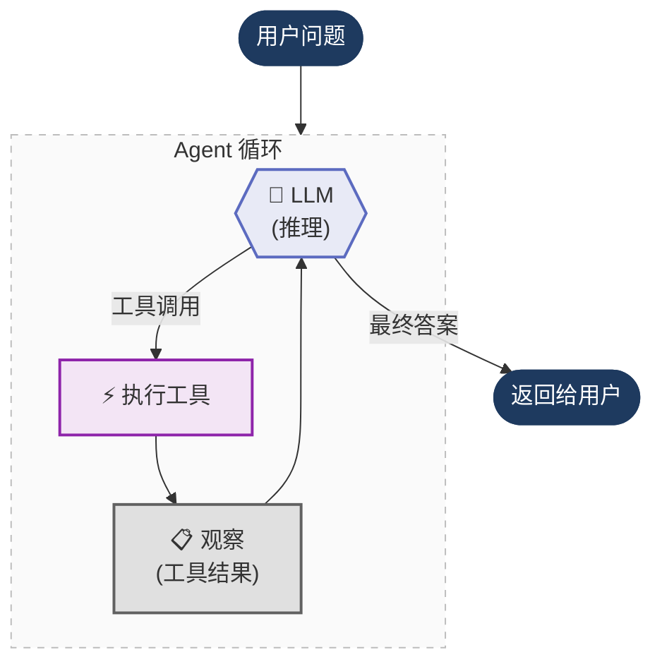

# Agent 的底层原理

**层层拆解 LangChain agent：从高层抽象一路下潜到原始提示词工程。**

在这一节里，我们用三种不同方式构建**同一个购物助手 agent**。每次都去掉一层抽象，这样你就能清楚看到底层到底发生了什么。

## 核心思想

每个 AI agent —— 无论是用 LangChain、LlamaIndex、CrewAI，还是从零手写 —— 都遵循同一个核心循环。我们将它实现三次，每次剥掉一层抽象：

1. **从 LangChain 开始** —— 这是你平时构建 agent 的常见方式：`@tool`、`bind_tools()`、`init_chat_model()`。它“开箱即用”。但底层到底做了什么？
2. **剥掉 LangChain** —— 只用 Ollama SDK 从零实现同一个 agent。这时你会看到 LangChain 原本替你做的事：手写 JSON schema、手动路由消息、原始工具分发。
3. **再剥掉 function calling** —— 继续向下。现代 LLM 内置了 function calling，但这是较新的特性（2023 年 6 月）。在那之前，agent 是靠纯提示词工程工作的：**ReAct 模式**。我们彻底去掉 function calling，只用 prompt 模板 + regex 来实现。

```
┌─────────────────────────────────────────────┐
│  文件 1：LangChain                          │  ← @tool, bind_tools(), ToolMessage
│  ┌────────────────────────────────────────┐  │
│  │  文件 2：原始 Function Calling         │  │  ← 手写 JSON schema, ollama.chat()
│  │  ┌─────────────────────────────────┐   │  │
│  │  │  文件 3：原始 ReAct Prompt      │   │  │  ← Prompt 模板, regex, scratchpad
│  │  └─────────────────────────────────┘   │  │
│  └────────────────────────────────────────┘  │
└─────────────────────────────────────────────┘
```

每个文件都是自包含的，可以单独运行。

---

## Agent 循环

在本质上，这三种实现共享同一个循环：agent 先推理，选择工具，执行工具，观察结果，然后重复，直到得到最终答案。



三份代码真正变化的是每一步**如何实现**：

| 步骤 | 文件 1（LangChain） | 文件 2（原始 Function Calling） | 文件 3（原始 ReAct） |
|------|------|------|------|
| **Reason（推理）** | LLM 返回结构化 `tool_calls` | LLM 返回结构化 `tool_calls` | LLM 输出文本：`Thought: ... Action: ...` |
| **Parse（解析）** | `ai_message.tool_calls[0]` | `message.tool_calls[0].function` | 正则：`r"Action:\s*(.+)"` |
| **Execute（执行）** | `tool.invoke(args)` | `tools[name](**args)` | `tools[name](*args)` |
| **Observe（观察）** | 追加 `ToolMessage` | 追加 `{"role": "tool"}` 字典 | 追加到 scratchpad 字符串 |
| **Finish（结束）** | 响应中没有 tool calls | 响应中没有 tool calls | 文本中找到 `"Final Answer:"` |

---

## 三种实现

### 1. LangChain Tool Calling
**文件：** [`1_agent_loop_langchain_tool_calling.py`](1_agent_loop_langchain_tool_calling.py)

我们从这里开始 —— 这是你平时最常见的 agent 实现方式。按代码从上到下看：

- **导入与配置** —— LangChain、LangSmith、模型名
- **工具** —— 两个普通 Python 函数，用 `@tool` 装饰。LangChain 会根据函数签名和 docstring 自动生成 JSON schema，不需要你手写。
- **Agent 循环** —— 用 `init_chat_model(f"ollama:{MODEL}")` 初始化 LLM，`bind_tools()` 绑定工具，然后循环：调用 LLM、检查是否返回工具调用、执行工具、追加 `ToolMessage`、继续下一轮。

**LangChain 给你的能力：**
- `@tool` → 根据函数自动生成 JSON 工具 schema
- `init_chat_model()` → 只改一个字符串就能切换 provider（`"ollama:qwen3"` → `"openai:gpt-4o"`）
- `bind_tools()` → 把工具定义绑定到 LLM
- `ToolMessage` → 统一处理工具结果消息格式
- 强类型消息对象（`SystemMessage`、`HumanMessage`）而不是原始字典

它确实很好用。但这些抽象背后到底发生了什么？

**技术栈：** `langchain`，以及用于追踪的 `langsmith`

---

### 2. 原始 Function Calling（不使用 LangChain）
**文件：** [`2_agent_loop_raw_function_calling.py`](2_agent_loop_raw_function_calling.py)

现在我们剥掉 LangChain，只用 `ollama` Python SDK 构建完全相同的 agent。和文件 1 并排对比，你会清楚看到 LangChain 原本替你做了什么。按代码从上到下看：

- **导入与配置** —— 只有 `ollama` 和 `langsmith`，不再使用 LangChain。
- **工具** —— 还是同样两个 Python 函数，但现在它们只是普通函数（没有 `@tool` 装饰器）。
- **工具注册表** —— 一个简单字典，把工具名映射到函数。在文件 1 里，这部分由 LangChain 通过 `{t.name: t for t in tools}` 帮你完成。
- **JSON 工具 schema** —— 手写 JSON 字典描述每个工具的名称、描述和参数。这正是文件 1 中 `@tool` 自动生成的内容；你会看到它相当啰嗦。
- **Agent 循环** —— 直接调用 `ollama.chat()`，通过 `tools=` 传入 JSON schema，读取 `response.message.tool_calls`，再用 `tools[name](**args)` 分发执行，并把原始 `{"role": "tool"}` 字典追加到消息历史。

**去掉 LangChain 后你会看到：**
- 工具 schema 需要手写，大约 30 行 JSON
- 消息是原始字典（`{"role": "system", "content": "..."}`），不再是强类型对象
- 工具结果用 `{"role": "tool", "content": result}` 追加，而不是 `ToolMessage`
- 若要切换 provider（OpenAI、Anthropic），需要重写 SDK 调用、消息格式与工具 schema 格式

**技术栈：** `ollama` SDK，以及用于追踪的 `langsmith`

---

### 3. 原始 ReAct Prompt（无 Function Calling、无 LangChain）
**文件：** [`3_raw_react_prompt.py`](3_raw_react_prompt.py)

现在我们连 function calling 本身也剥掉。这就是 **LLM 内置工具调用出现之前**（2023 年 6 月之前）agent 的常见做法。API 响应里不再有结构化 `tool_calls` —— LLM 只输出原始文本，我们再用 regex 解析。按代码从上到下看：

- **导入与配置** —— `ollama`、`re`（正则）、`langsmith`。没有 LangChain，也没有 function calling。
- **工具** —— 仍是同样两个 Python 函数，仍用同一个工具注册表字典。
- **ReAct prompt 模板** —— 这是核心。我们不再把 JSON 工具 schema 传给 API，而是把工具说明以纯文本方式写进 prompt。prompt 同时要求 LLM 严格遵循格式：`Thought → Action → Action Input → Observation`。这就是 [Yao et al. 2022](https://arxiv.org/abs/2210.03629) 提出的原始 **ReAct 模式**。
- **Agent 循环** —— 与文件 1 和 2 完全不同：
  - 把完整 prompt（模板 + 累积的 scratchpad）作为单条 user message 发送
  - 使用 `stop=["\nObservation"]`，让 LLM 在生成 Observation 前停止，以便我们注入真实工具结果，避免模型幻觉
  - 用 regex 解析 LLM 的原始文本输出，提取 `Action:` 和 `Action Input:`
  - 执行工具后，把完整轨迹（`Thought/Action/Observation`）追加到 scratchpad 字符串
  - 在文本中检查是否出现 `"Final Answer:"`，据此判断是否结束

**没有 function calling 时的关键差异：**
- 没有 JSON schema —— 工具只以 prompt 文本描述
- 没有结构化 `tool_calls` —— LLM 输出类似 `Action: get_product_price` 的文本
- 没有消息历史对象 —— 改为用 **scratchpad** 字符串累积完整推理链
- 解析更脆弱 —— 如果 LLM 不严格遵守格式，regex 容易失效
- `stop` 参数至关重要 —— 没有它，LLM 很可能会“编造”工具结果

**技术栈：** `ollama` SDK、`re`（正则）、以及用于追踪的 `langsmith`

---

## 同一个 Agent，三种写法

三份文件都在回答同一个问题，并使用同一组工具：

> **"给笔记本电脑应用 gold 折扣后的价格是多少？"**

**工具：**
- `get_product_price(product)` —— 从目录查询价格（laptop: $1,299.99）
- `apply_discount(price, discount_tier)` —— 按指定折扣等级打折（gold: 23% off）

**预期流程：**
1. Agent 调用 `get_product_price("laptop")` → 得到 `1299.99`
2. Agent 调用 `apply_discount(1299.99, "gold")` → 得到 `1000.99`
3. Agent 返回最终答案

折扣等级使用了不那么直观的比例（bronze: 5%、silver: 12%、gold: 23%），这样 LLM 不能靠猜，**必须**调用工具。

---

## 快速开始

```bash
git checkout project/agents-under-the-hood
uv sync
```

运行每种实现：
```bash
uv run python 1_agent_loop_langchain_tool_calling.py
uv run python 2_agent_loop_raw_function_calling.py
uv run python 3_raw_react_prompt.py
```

## 前置条件

- 本地运行 **Ollama**，并已拉取 `qwen3:1.7b` 模型（`ollama pull qwen3:1.7b`）
- `.env` 中配置 **LangSmith API key**（可选，用于 tracing）
