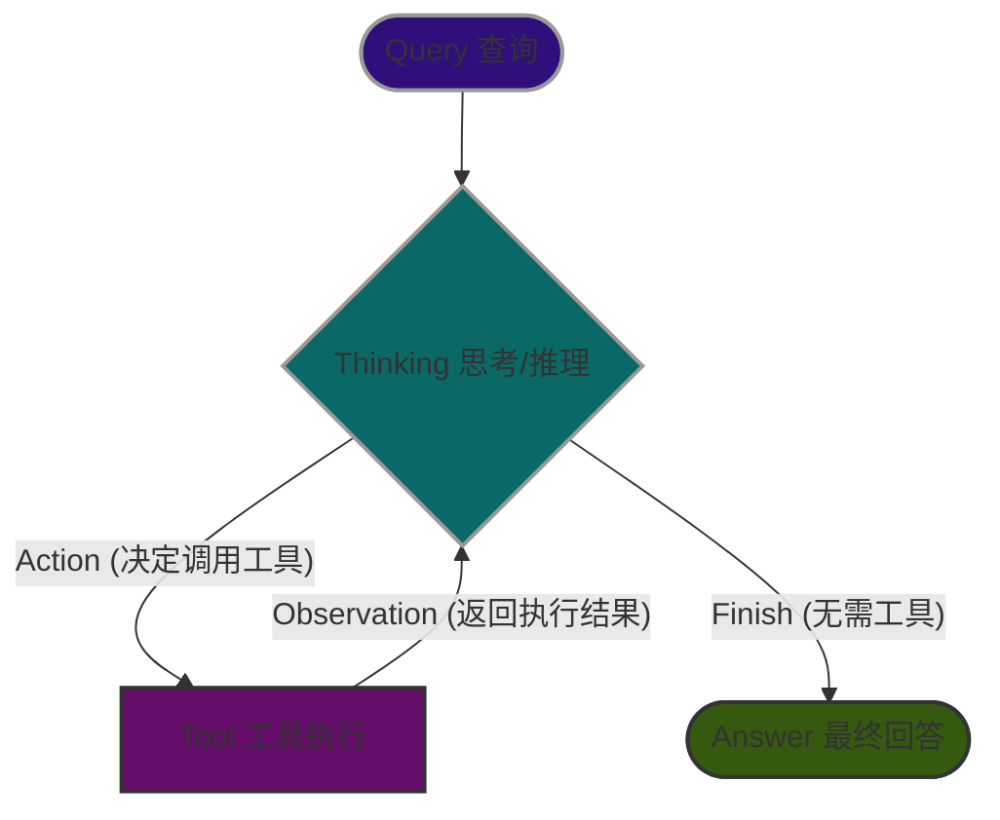

课程总结：ReAct Agent 架构与演进史
本节课程主要回顾了 ReAct (Reason + Act) 算法的核心执行流程，并详细梳理了 LangChain 生态中 ReAct Agent 从早期提示词驱动，到最新的 LangGraph 架构的演进过程。

1. ReAct Agent 核心运行流程
ReAct 算法的核心在于将大语言模型（LLM）作为推理引擎，形成一个“思考 -> 行动 -> 观察”的闭环。它的基本执行流如下：

接收用户的 Query（查询）。

LLM 进行 Thinking（思考/推理），决定接下来需要调用哪个工具。

执行 Action（行动），即调用指定的 Tool（工具）。

获取工具执行后的 Observation（观察/结果），并将其反馈给 LLM。

LLM 再次思考，重复上述过程，直到得出最终答案（Finish -> Answer）。

2. ReAct Agent 的演进历程
随着大模型能力的发展和框架的成熟，ReAct Agent 的实现方式经历了一系列重要的迭代：

```mermaid
graph LR
    A[LangChain ReAct Agent<br/>基于 ReAct Prompt] --> B[Tool Calling Agent<br/>基于 Function Calling]
    B --> C[LangGraph ReAct Agent<br/>基于 Function Calling]
    C --> D[LangChain v1.0<br/>create_agent函数]
    
    D -. 底层依赖 .-> C
    
    style A fill:#0b4745,stroke:#333
    style B fill:#0b4745,stroke:#333
    style C fill:#0b4745,stroke:#333
    style D fill:#0b4745,stroke:#333
```

第一阶段：LangChain ReAct Agent（基于提示词）
原理：基于最初的 ReAct 论文，依赖特定的提示词（Prompt）让 LLM 输出思考过程和要执行的工具名称。

痛点：因为早期的模型能力有限，LangChain 需要用复杂的逻辑去解析（Parse）模型的文本输出。由于模型输出具有随机性（非确定性），哪怕生成错了一个 Token，都会导致整个解析过程崩溃，因此在生产环境中不够可靠。

第二阶段：Tool Calling Agent（基于函数调用）
原理：随着模型能力的提升，各家厂商（如 OpenAI）推出了原生 Function Calling（函数调用） 能力。模型能够自动在特定字段返回结构化的工具调用请求。

优势：不再需要复杂的提示词和脆弱的输出解析。

痛点与解决：由于各家大模型厂商的 API 接口不一致（有的叫 Function Calling，有的叫 Tool Calling），LangChain 抽象出了统一的 Tool Calling 接口，屏蔽了底层的厂商差异。

第三阶段：LangGraph ReAct Agent（图架构）
原理：早期的 Agent 是一个封装在 AgentExecutor 类中的 while 循环，缺乏透明度和控制力。LangGraph 将 Agent 重新建模为图（Graph）结构。

三大核心组件：

State（状态）：一个字典，用于保存对话上下文和中间计算结果。

Nodes（节点）：接收 State，执行计算（如调用 LLM 或工具），并返回更新后的 State 的 Python 函数。

Edges（边）：定义节点间的控制流。

第四阶段：LangChain v1.0 create_agent()
原理：伴随 LangChain 1.0 的发布，官方废弃了旧的 ReAct agent 创建方法，推出了统一且极简的 create_agent() API。

优势：开发者只需要传入模型和工具，就能一键生成一个可直接使用的 ReAct Agent。它底层依然运行着编译好的 LangGraph 图，因此继承了 LangGraph 的所有高级特性，同时极大简化了使用门槛。

3. LangGraph 架构带来的核心优势
视频特别强调了从 while 循环转向 LangGraph 架构所带来的巨大红利：

控制流可视化（Visibility）：以前的执行逻辑是“黑盒”循环，现在由于显式的图结构，可以直接将控制流打印成直观的图片，方便理解程序的走向。

状态管理的简化（State Management）：在旧版 AgentExecutor 中管理状态非常麻烦（需要依赖关键字参数和配置对象）。而在 LangGraph 中，只需在 State 的 Schema 中定义字段即可轻松追踪。

内置检查点与时间旅行（Checkpoints & Time Travel）：在执行每个节点前，LangGraph 会自动持久化 State。这使得开发者可以监控、追踪，甚至“时光倒流”去查看并调试 Agent 在特定时刻的行为。

图的组合性（Composability）：这是最大的突破之一，允许将一个构建好的图作为一个节点嵌套在另一个图之中（即 Multi-Agent/图嵌套），极大提升了复杂任务的构建能力。

课程核心寄语： 虽然现在你可以通过 create_agent() 像使用魔法一样一键创建 Agent，但了解底层的图架构、历史演进和它的工作原理（It's not magic），才是构建现代高级 LLM Agent 的坚实基础。