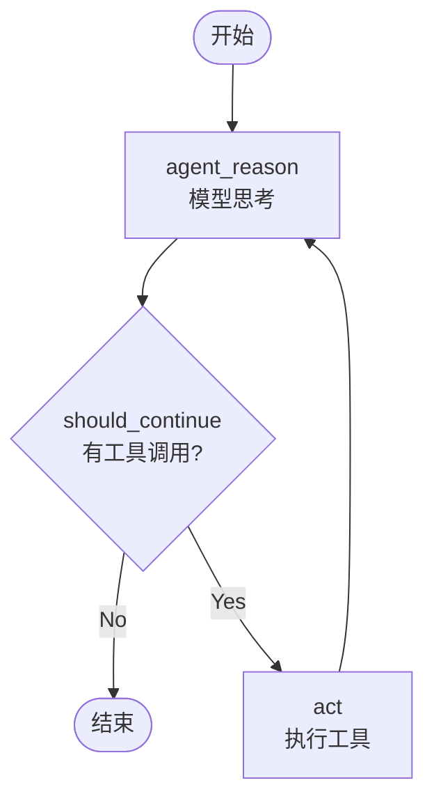
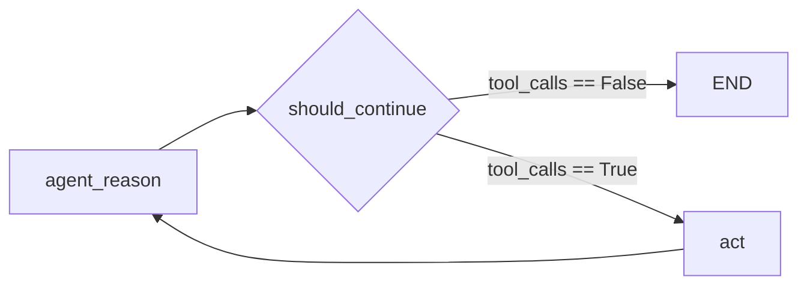
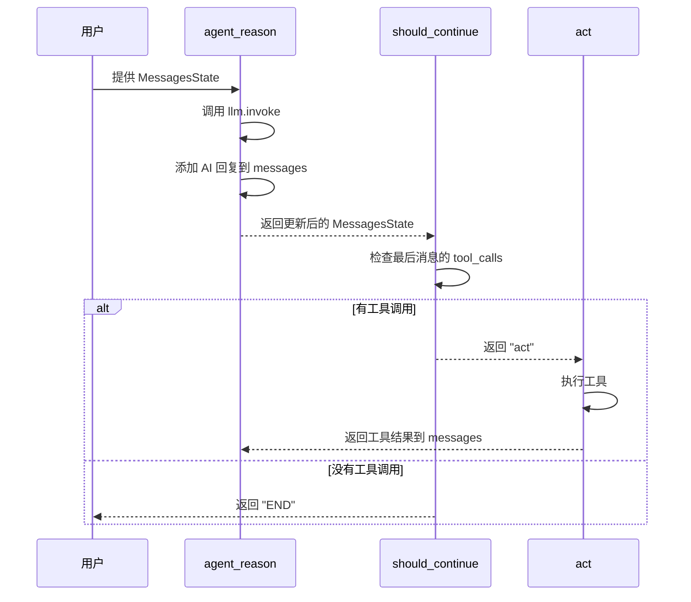
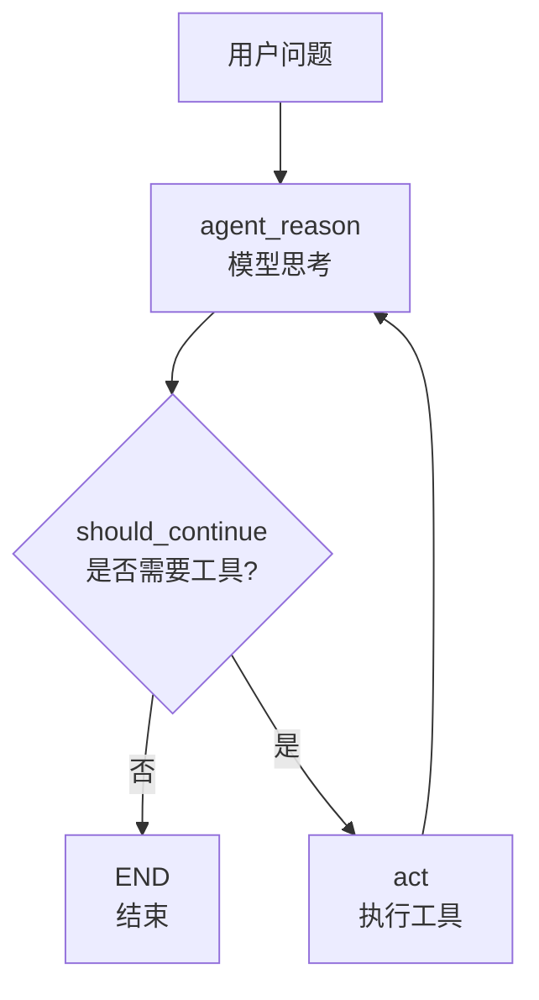
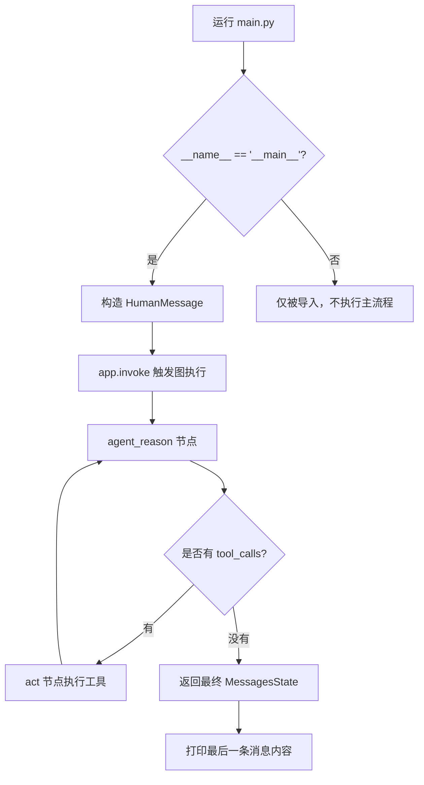

# `main.py` 学习指南（上）：用 StateGraph 把节点串成图

> 这份笔记的重点是：**理解图的概念、如何定义节点和边、如何用条件边实现智能流转**。
> 
> 注意：这是视频 / 代码的上半部分。更新会在代码补充后继续。

## 1. 这个文件是做什么的？

`main.py` 的核心职责是：

> 把 `react.py` 的"能力"和 `nodes.py` 的"节点"组织成一个可以流转的"图"。

如果前面两个文件分别是：

- `react.py`：提供工具
- `nodes.py`：定义节点

那么 `main.py` 就是：

- 定义图的流转逻辑
- 节点怎么连接
- 什么时候从一个节点跳到另一个节点
- 最后编译成可运行的 app

---

## 2. 代码整体结构

这个文件主要做了 5 件事：

1. 导入核心组件
2. 定义常数和辅助变量
3. 定义条件判断函数
4. 创建和配置图
5. 编译图并输出

对应的核心代码可以简化为：

```python
from langgraph.graph import MessagesState, StateGraph, END
from langchain_core.messages import HumanMessage

from nodes import run_agent_reasoning_engine, tool_node

# 1. 定义常数
AGENT_REASON = "agent_reason"
ACT = "act"
LAST = -1

# 2. 定义条件函数
def should_continue(state: MessagesState) -> str:
    if not state["messages"][LAST].tool_calls:
        return END
    return ACT

# 3. 创建图
flow = StateGraph(MessagesState)

# 4. 添加节点和边
flow.add_node(AGENT_REASON, run_agent_reasoning_engine)
flow.set_entry_point(AGENT_REASON)
flow.add_node(ACT, tool_node)
flow.add_conditional_edges(AGENT_REASON, should_continue, {END: END, ACT: ACT})
flow.add_edge(ACT, AGENT_REASON)

# 5. 编译
app = flow.compile()
```

---

## 3. 核心概念解释

### 3.1 `StateGraph`：什么是图？

`StateGraph` 是 LangGraph 提供的最通用的图类型。

你可以把它想象成：

```
一个节点网络，节点之间通过边连接，
通过状态在节点之间传递信息。
```

更具体来说：

- **节点**（Node）：一个可执行的单位，比如 `run_agent_reasoning_engine`
- **边**（Edge）：规定节点之间的连接路径
- **状态**（State）：节点之间传递的数据，这里是 `MessagesState`

### 为什么需要图？

因为我们的 agent 不是线性执行的。有时候它需要：

- 先思考
- 再决定要不要调用工具
- 如果要调用，执行工具
- 再回到思考阶段

这种"决策 → 执行 → 再决策"的循环，用图来表现就很自然。

---

### 3.2 `MessagesState`：图用什么状态？

我们在这里用 `MessagesState` 作为图的状态类型。

这和 `nodes.py` 里使用的是同一个。

意思是：

- 图的每个节点都会接收这个状态
- 每个节点都可以修改这个状态
- 状态会自动传递给下一个节点

---

### 3.3 常数定义的意义

```python
AGENT_REASON = "agent_reason"
ACT = "act"
LAST = -1
```

这些常数的作用是：

- `AGENT_REASON`：代理思考节点的名称
- `ACT`：工具执行节点的名称
- `LAST`：代表列表的最后一个元素（Python 中 `-1` 就是最后一个）

### 为什么要定义常数？

相比直接写字符串，使用常数有好处：

- 代码更清晰
- 如果需要改名，只需改一个地方
- 减少笔误

---

### 3.4 `should_continue` 函数：条件判断逻辑

这是整个文件最重要的函数之一。

```python
def should_continue(state: MessagesState) -> str:
    if not state["messages"][LAST].tool_calls:
        return END
    return ACT
```

#### 它的职责

判断接下来应该去哪个节点。

#### 它怎么判断？

```python
state["messages"][LAST].tool_calls
```

这一行把状态里的：

1. 消息列表：`state["messages"]`
2. 最后一条消息：`[LAST]`
3. 这条消息是否包含工具调用：`.tool_calls`

#### 判断逻辑

- **如果没有工具调用**（`not state["messages"][LAST].tool_calls`）
  - 说明模型已经决定直接回答
  - 返回 `END`，图的执行结束
  
- **如果有工具调用**
  - 说明模型觉得需要调用工具
  - 返回 `ACT`，去执行工具

### 理解这一步的关键

这个函数体现了智能 agent 的核心流转逻辑：

> 模型的回复可能包含两种情况：直接回答 或 工具调用。
> 根据此判断下一步该做什么。

---

## 4. 图的构建步骤

现在来看如何一步步搭建这个图。

### 4.1 创建图对象

```python
flow = StateGraph(MessagesState)
```

这创建了一个空的图框架，告诉它使用 `MessagesState` 作为状态类型。

### 4.2 添加节点

```python
flow.add_node(AGENT_REASON, run_agent_reasoning_engine)
flow.add_node(ACT, tool_node)
```

这添加了两个节点：

- 名称为 `"agent_reason"` 的节点，对应 `run_agent_reasoning_engine` 函数
- 名称为 `"act"` 的节点，对应 `tool_node` 对象

### 4.3 设置入口点

```python
flow.set_entry_point(AGENT_REASON)
```

这告诉图：当执行开始时，第一个要调用的节点是 `"agent_reason"`。

也就是说，用户的问题首先会被送到代理思考节点。

### 4.4 添加条件边

```python
flow.add_conditional_edges(AGENT_REASON, should_continue, {END: END, ACT: ACT})
```

这一行很关键，它定义了从 `"agent_reason"` 节点出发的条件分支：

- **第一个参数**：起点节点 `AGENT_REASON`
- **第二个参数**：判断函数 `should_continue`
- **第三个参数**：映射字典 `{END: END, ACT: ACT}`

#### 映射字典是什么意思？

`should_continue` 会返回一些值（例如 `END` 或 `ACT`）。

这个字典告诉图：

- 如果返回 `END`，就去 `END` 节点（结束图）
- 如果返回 `ACT`，就去 `ACT` 节点（执行工具）

### 4.5 添加普通边

```python
flow.add_edge(ACT, AGENT_REASON)
```

这定义了一条从 `"act"` 节点回到 `"agent_reason"` 节点的边。

意思是：

- 工具执行完后，结果要重新送回到代理思考节点
- 代理会再决定一次：是否需要继续调用工具，或者直接回答

这体现了 agent 循环的本质。

### 4.6 编译图

```python
app = flow.compile()
```

这将图的定义转换成可执行的对象。

只有编译后，图才能真正运行。

---

## 5. 图的整体流转流程

下面是这个图从开始到结束的典型执行路径。



### 理解这个流程

1. **开始**：图从 `agent_reason` 节点开始
2. **思考**：模型接收用户问题和历史消息，生成回复或工具调用
3. **判断**：检查模型是否返回了工具调用请求
4. **执行或结束**：
   - 如果没有工具调用，直接结束
   - 如果有工具调用，去执行工具
5. **循环**：工具执行后，结果回到思考阶段，模型再判断一次

---

## 6. 条件边的详细理解

条件边是 LangGraph 中最强大的特性之一。



### 为什么需要条件边？

因为现实中的流转不总是线性的。

有时候我们需要根据当前状态，动态决定下一步。

条件边允许我们：

- 检查状态
- 根据检查结果返回不同的节点名称
- 图会自动路由到对应的节点

### tool_calls 是什么？

在 LangChain 的消息格式中，当模型支持工具调用时，它的输出会包含 `tool_calls` 字段。

这个字段包含：

- 工具名称
- 工具参数

当模型不需要工具时，`tool_calls` 会是空的或不存在。

---

## 7. 节点之间的消息流

下面是消息如何在节点之间流转的。



### 每一步发生了什么

1. 用户消息进入 `agent_reason` 节点
2. 该节点调用模型，并更新状态
3. 新状态传到 `should_continue` 函数
4. 函数判断下一步方向
5. 如果需要工具，进入 `act` 节点并执行
6. 工具结果写回状态，再次进入 `agent_reason`
7. 如果不需要工具，图结束

---

## 8. `END` 是什么？

在代码里你会看到 `END`：

```python
from langgraph.graph import END
```

`END` 是一个特殊的常数，表示：

- 图的执行应该结束
- 不再有后续节点

### END 和其他节点的区别

- **普通节点**：有对应的函数/对象来执行
- **END 节点**：没有执行逻辑，只是表示"结束"

---

## 9. 为什么需要编译？

```python
app = flow.compile()
```

编译的意义：

- 验证图的定义是否合法
  - 是否有悬空的节点？
  - 是否有循环依赖？
  
- 优化图的执行
  - 预处理边和节点
  - 准备状态管理机制

- 生成可运行的对象
  - 之前 `flow` 只是定义
  - `app` 才是真正可以 `invoke` 的对象

---

## 10. 输出图的可视化

代码中有这一行：

```python
app.get_graph().draw_mermaid_png(output_file_path="flow.png")
```

这的作用是：

- 生成你在视频中看到的图的 PNG 文件
- 保存到 `flow.png`

这对于调试 agent 逻辑非常有帮助。

---

## 11. 易错点和常见误区

### 11.1 节点名称要一致

```python
flow.add_node("agent_reason", run_agent_reasoning_engine)
# 后面要用同样的名字：
flow.set_entry_point("agent_reason")
```

如果名称不一致，图会报错。

### 11.2 条件边的返回值必须映射到节点

```python
flow.add_conditional_edges(AGENT_REASON, should_continue, {END: END, ACT: ACT})
```

`should_continue` 返回的值必须在这个字典里出现。

否则图不知道该去哪个节点。

### 11.3 `tool_calls` 可能不存在

某些模型或旧版本的消息格式中，`tool_calls` 可能没有这个属性。

所以要小心 AttributeError。

### 11.4 状态在节点间自动传递

你不需要手动"传递"状态。

图会自动把一个节点的输出作为下一个节点的输入。

### 11.5 不编译就不能运行

`flow` 对象本身不能运行，必须先 `compile()` 成 `app`。

---

## 12. 一个更直观的心智模型

你可以把这个图想象成一个循环流程：



这个循环会一直进行，直到模型决定不再调用工具。

---

## 13. 你应该记住的最重要一句话

> **图把"思考"和"执行"组织成一个循环流程。条件边是这个循环的"交通枢纽"。**

---

## 14. 练习题

试着回答这些问题来检查理解：

1. `StateGraph` 和普通函数调用的主要区别是什么？
2. `should_continue` 为什么返回字符串而不是布尔值？
3. 为什么 `add_edge(ACT, AGENT_REASON)` 这个循环边是必要的？
4. `tool_calls` 为空时会发生什么？
5. 如果不编译图，会发生什么？

---

## 15. 小结（上半部分）

这一部分介绍了：

- 图的基本概念
- 如何定义节点和边
- 条件边如何实现智能流转
- `should_continue` 函数的核心作用

关键要点：

- 图 = 节点 + 边 + 状态
- 条件边 = 智能路由的基础
- `tool_calls` 判断 = 决策的关键

---

## 16. 运行图：把定义好的图真正跑起来

前面的内容都在讲“怎么搭图”。

这一部分开始讲“怎么运行图”。

### 16.1 脚本入口 `if __name__ == '__main__'`

```python
if __name__ == '__main__':
 print("ReAct LangGrapg with Function Calling")
 res = app.invoke({"messages":[HumanMessage(content="What is the temperature in tokyo? List it and triple it")]})
 print(res["messages"][LAST].content)
```

这段代码的作用是：

- 只有当你直接运行 `main.py` 时，它才会执行
- 如果这个文件被别的模块导入，这一段不会自动运行

这是一种非常常见的 Python 写法。

### 16.2 `HumanMessage`：用户输入的第一条消息

```python
HumanMessage(content="What is the temperature in tokyo? List it and triple it")
```

这里的 `HumanMessage` 表示用户说的话。

它会被放进图的 `messages` 状态里，作为第一轮输入。

你可以把它理解成：

> 用户的问题先被包装成标准消息对象，再交给图去处理。

### 16.3 `app.invoke(...)`：开始执行整个图

```python
res = app.invoke({"messages":[HumanMessage(content="What is the temperature in tokyo? List it and triple it")]})
```

这行代码的意思是：

- 给图喂入初始状态
- 触发整个节点流程开始运行
- 直到图走到 `END`
- 返回最终状态 `res`

这里传进去的是一个字典，键是 `messages`。

这和前面 `MessagesState` 的设计是一致的。

### 16.4 `res["messages"][LAST].content`：读取最终回答

```python
print(res["messages"][LAST].content)
```

这里做的是：

- 从返回结果里取出消息列表
- 取最后一条消息
- 打印这条消息的正文内容

通常最后一条消息就是模型的最终回答。

如果前面走过工具调用，那么最终消息一般已经包含工具结果整合后的答案。

### 16.5 `draw_mermaid_png(...)` 和真正运行的区别

```python
app.get_graph().draw_mermaid_png(output_file_path="flow.png")
```

这行不是在执行问答任务。

它只是把图结构画成图片，方便你查看节点和边。

也就是说：

- `draw_mermaid_png` = 看图长什么样
- `invoke` = 真正跑图、处理输入、生成答案

### 16.6 一个更完整的运行流程图



### 16.7 把上半部分和下半部分串起来理解

现在你可以把整个 `main.py` 的流程理解为两段：

#### 第一段：定义图

- 创建 `StateGraph`
- 添加 `agent_reason` 和 `act` 两个节点
- 设置入口点
- 添加条件边和回路边
- 编译成 `app`

#### 第二段：运行图

- 准备一个 `HumanMessage`
- 调用 `app.invoke(...)`
- 图开始循环执行
- 最后打印最终回复

也就是说：

> 上半部分负责“搭建系统”，下半部分负责“把系统跑起来”。

### 16.8 当前代码里几个容易忽略的小点

你会看到顶部还有一些导入，比如：

- `START`
- `messages`

在当前这版代码里它们暂时没有参与主逻辑。

这不影响你理解核心流程，先把重点放在：

- `StateGraph`
- `should_continue`
- `app.invoke(...)`
- `HumanMessage`
- 最后 `print` 的结果

---

## 17. 快速参考

```python
# 导入核心块
from langgraph.graph import StateGraph, MessagesState, END
from langchain_core.messages import HumanMessage
from nodes import run_agent_reasoning_engine, tool_node

# 定义常数
AGENT_REASON = "agent_reason"
ACT = "act"
LAST = -1

# 定义条件函数
def should_continue(state: MessagesState) -> str:
    if not state["messages"][LAST].tool_calls:
        return END
    return ACT

# 创建图
flow = StateGraph(MessagesState)
flow.add_node(AGENT_REASON, run_agent_reasoning_engine)
flow.set_entry_point(AGENT_REASON)
flow.add_node(ACT, tool_node)
flow.add_conditional_edges(AGENT_REASON, should_continue, {END: END, ACT: ACT})
flow.add_edge(ACT, AGENT_REASON)

# 编译
app = flow.compile()

# 可视化
app.get_graph().draw_mermaid_png(output_file_path="flow.png")
```

