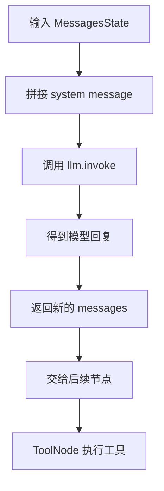
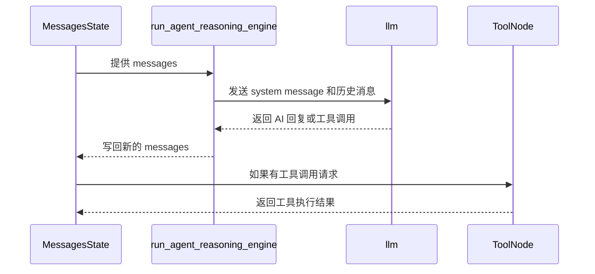
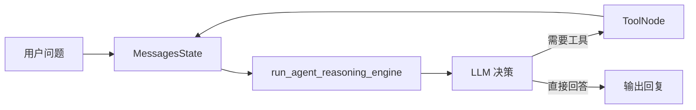

# `nodes.py` 学习指南：理解 LangGraph 的节点如何工作

> 这份笔记的重点是：**看懂 `nodes.py` 里每一块代码的职责，以及它如何为后续的图编排做准备**。

## 1. 这个文件是做什么的？

`nodes.py` 负责定义图里的“节点”。

如果说 `react.py` 是在准备“模型 + 工具”，那么 `nodes.py` 更像是在定义：

- 模型先怎么思考
- 什么时候把结果交给工具执行
- 状态怎么在节点之间传递

你可以把它理解成：

> `react.py` 提供能力，`nodes.py` 组织这些能力在图里运行。

---

## 2. 代码整体结构

这个文件主要做了三件事：

1. 导入状态和工具执行节点
2. 导入 `react.py` 里准备好的 `llm` 和 `tools`
3. 定义两个关键对象：
   - `run_agent_reasoning_engine`
   - `tool_node`

对应的核心代码可以概括成这样：

```python
from dotenv import load_dotenv
from langgraph.graph import MessagesState
from langgraph.prebuilt import ToolNode

from react import llm, tools

load_dotenv()

SYSTEM_MESSAGE = """
You are a helpful assistant that can use tools to answer questions.
"""


def run_agent_reasoning_engine(state: MessagesState) -> MessagesState:
    response = llm.invoke([{"role": "system", "content": SYSTEM_MESSAGE}, *state["messages"]])
    return {"messages": [response]}


tool_node = ToolNode(tools=tools)
```

---

## 3. 核心概念解释

### 3.1 `MessagesState`：保存对话消息的状态

`MessagesState` 是一个很重要的状态类型。

你可以把它理解成一个字典结构，里面最关键的键是：

- `messages`

这个 `messages` 通常是一个列表，里面存放对话消息，例如：

- 用户消息
- AI 消息
- 工具调用返回的消息

### 为什么它重要？

因为图在运行时，必须知道：

- 当前聊到哪一步了
- 之前说过什么
- 接下来该不该继续调用工具

所以 `MessagesState` 的作用就是：**把对话历史保留下来并在节点之间传递**。

---

### 3.2 `SYSTEM_MESSAGE`：给模型的固定规则

```python
SYSTEM_MESSAGE = """
You are a helpful assistant that can use tools to answer questions.
"""
```

这是系统提示词。

它的作用是告诉模型：

- 你是一个助手
- 你可以使用工具
- 你的任务是帮助回答问题

### 为什么需要 system message？

因为模型在每次调用时，不只是看用户输入，还会先看这些“更高优先级”的规则。

这能让模型更稳定地按照预期工作。

---

### 3.3 `run_agent_reasoning_engine`：负责“思考”的节点

这是整个文件最关键的函数之一。

它的职责是：

1. 接收当前状态 `state`
2. 把系统提示词和历史消息一起发给模型
3. 得到模型回复
4. 把模型回复写回状态

你可以把它理解为：

> 这是“先让模型想一想”的那一步。

#### 函数签名

```python
def run_agent_reasoning_engine(state: MessagesState) -> MessagesState:
```

意思是：

- 输入：当前消息状态
- 输出：更新后的消息状态

---

### 3.4 `llm.invoke([...])`：一次模型调用

```python
response = llm.invoke([{"role": "system", "content": SYSTEM_MESSAGE}, *state["messages"]])
```

这行代码做了两件事：

1. 把 system message 放在最前面
2. 再把历史消息全部传给模型

### 为什么要把历史消息一起传？

因为模型需要上下文。

如果只给当前一句话，它可能不知道：

- 前面问了什么
- 之前工具返回了什么
- 当前回答应该延续什么语境

所以把 `state["messages"]` 传进去，就能保留完整对话链。

---

### 3.5 `state["messages"]`：读取对话历史

这一点非常关键。

`state["messages"]` 的意思是：

- 从状态里取出消息列表
- 把它作为模型输入的一部分

你可以把它想象成一个“记忆袋子”：

- 里面装着所有对话记录
- 每次节点运行时，都会把这些记录再拿出来

---

### 3.6 `return {"messages": [response]}`：把新消息写回状态

```python
return {"messages": [response]}
```

这表示：

- 当前节点运行结束
- 新生成的 AI 回复要加入消息流
- 后续节点可以继续使用它

注意这里返回的是一个字典，而不是直接返回字符串。

因为在 LangGraph 里，节点之间传递的是状态更新，而不是“随便一个值”。

---

### 3.7 `ToolNode`：执行工具的节点

```python
tool_node = ToolNode(tools=tools)
```

`ToolNode` 是 LangGraph 提供的预构建节点。

它的作用是：

- 检查最近一条消息里有没有工具调用请求
- 如果有，就真正执行对应工具
- 把工具结果再放回消息流

### 你可以怎么理解它？

模型负责“决定”，`ToolNode` 负责“执行”。

也就是说：

- 模型说“我要查一下”
- `ToolNode` 才真的去调用搜索工具

---

## 4. 这个文件的执行流程

下面是 `nodes.py` 的核心执行路径。



### 这张图怎么理解？

1. 图先接收到一个状态对象
2. `run_agent_reasoning_engine` 把上下文整理好
3. 模型生成回复，可能包含工具调用意图
4. `ToolNode` 根据模型输出真正执行工具

---

## 5. 模型和工具节点是怎么配合的？



### 关键理解点

这个流程本质上是：

- 先让模型思考
- 如果需要工具，再交给工具节点执行
- 工具结果再回到状态里

---

## 6. `nodes.py` 和 `react.py` 的关系

这两个文件是配套的。

### `react.py` 做什么？

它负责：

- 定义工具
- 绑定工具到模型
- 准备可调用工具的 `llm`

### `nodes.py` 做什么？

它负责：

- 定义“如何思考”的节点
- 定义“如何执行工具”的节点
- 为后续图编排提供基础积木

你可以把它理解成：

- `react.py` = 备好材料
- `nodes.py` = 把材料切成能拼装的模块

---

## 7. 为什么这里不需要写很多复杂逻辑？

这是 LangGraph 和 function calling 的一个重要优势。

以前如果你手写工具调用逻辑，通常需要：

- 解析模型输出格式
- 判断是否触发工具
- 手动调用工具
- 再把工具结果拼回上下文

而现在这些步骤大部分都被封装了：

- `llm.bind_tools(...)` 让模型知道工具信息
- `llm.invoke(...)` 负责一次智能判断
- `ToolNode` 负责执行工具

所以代码量会少很多，也更清晰。

---

## 8. 易错点和理解误区

### 8.1 `MessagesState` 不是普通变量

它是图状态的一部分，不只是一个临时列表。

### 8.2 `ToolNode` 不是模型

它不会自己“思考”，它只负责执行模型已经决定好的工具调用。

### 8.3 `run_agent_reasoning_engine` 不是最终回答器

它更像是“中间决策节点”。

### 8.4 `state["messages"]` 需要保持顺序

消息的顺序非常重要，因为模型依赖上下文顺序来判断当前该做什么。

### 8.5 system message 不要乱改

系统提示词会影响整个 agent 的行为风格。

---

## 9. 更深入一点：为什么这种设计适合图编排？

因为图本质上就是“节点 + 状态 + 流转规则”。

在这个文件里：

- `run_agent_reasoning_engine` 是一个节点
- `tool_node` 是一个节点
- `MessagesState` 是节点之间传递的数据

这就天然适合接到后面的 `StateGraph` 里。

你后面可以很自然地写出这种结构：

- 先走 reasoning 节点
- 如果模型要调用工具，就走 tool 节点
- 工具结果回来后，再回 reasoning 节点

这就是一个典型的 agent 循环。

---

## 10. 一个更直观的心智模型

你可以把这个文件想成一个“会议流程”：

- `MessagesState`：会议记录本
- `SYSTEM_MESSAGE`：会议规则
- `run_agent_reasoning_engine`：主持人先发言、分析问题
- `ToolNode`：真正去查资料、计算、执行任务的人
- `llm`：负责决定下一步怎么走的分析员



---

## 11. 你应该记住的最重要一句话

> `nodes.py` 的核心不是“回答问题”，而是“把问题、记忆、模型和工具组织成可运行的节点流程”。

---

## 12. 练习题

你可以试着回答下面的问题，检查自己是否理解了：

1. `MessagesState` 为什么适合做图状态？
2. `run_agent_reasoning_engine` 的输入和输出分别是什么？
3. 为什么要把 `SYSTEM_MESSAGE` 放在消息列表最前面？
4. `ToolNode` 和 `llm` 的职责分别是什么？
5. 为什么 `nodes.py` 特别适合后面接 `StateGraph`？

---

## 13. 小结

这个文件虽然很短，但它承担了很重要的角色：

- 定义“思考节点”
- 定义“工具执行节点”
- 连接 `react.py` 中准备好的模型和工具
- 为后续图编排打下基础

如果你能理解这句话，就已经抓住了重点：

> **模型负责判断，工具负责执行，状态负责记忆，节点负责把它们串起来。**

