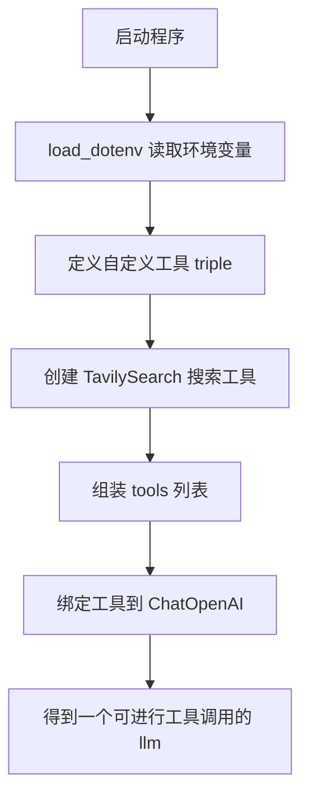
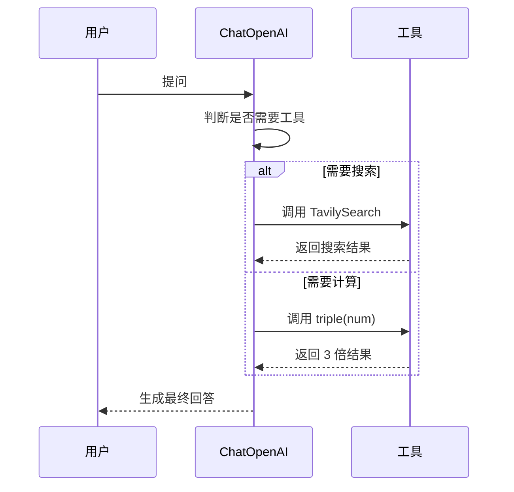
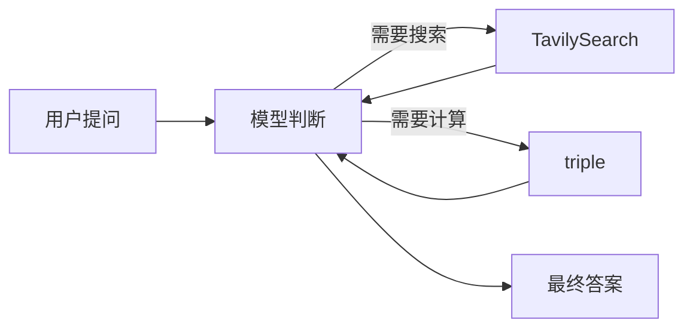

# `react.py` 学习指南：用工具调用理解 ReAct / Function Calling

> 这份笔记的目标不是逐行“翻译”代码，而是帮助你理解：**这个文件在整个项目里扮演什么角色、为什么要这么写、模型和工具是怎么配合的**。

## 1. 这个文件是做什么的？

`react.py` 的核心作用是：**准备好“模型 + 工具”这套能力**，让后续的图（graph）或节点（node）可以直接调用。

你可以把它理解为一个“工具箱配置文件”：

- 先加载环境变量
- 再定义一个自定义工具
- 再把第三方搜索工具也加入进来
- 最后把这些工具交给支持 function calling 的大模型

这样做之后，模型就不只是“聊天”，而是可以在需要时主动决定：

- 要不要调用工具
- 调用哪个工具
- 传什么参数

---

## 2. 代码整体结构

这个文件的逻辑可以概括成下面几步：

1. 导入必要组件
2. `load_dotenv()` 读取环境变量
3. 定义一个自定义工具 `triple`
4. 组合工具列表 `tools`
5. 创建支持工具调用的 LLM

简化后的结构如下：

```python
from dotenv import load_dotenv
from langchain_core.tools import tool
from langchain_openai import ChatOpenAI
from langchain_tavily import TavilySearch

load_dotenv()

@tool
def triple(num: float) -> float:
    return float(num) * 3

tools = [TavilySearch(max_results=1), triple]
llm = ChatOpenAI(model="gpt-4o-mini", temperature=0).bind_tools(tools)
```

---

## 3. 逐个概念解释

### 3.1 `load_dotenv()`：读取环境变量

这个函数会从 `.env` 文件中加载环境变量。

通常你会在里面放这些内容：

- OpenAI API Key
- Tavily API Key
- 其他密钥或配置

这样做的好处是：

- 不需要把密钥写死在代码里
- 本地开发和部署环境更容易切换
- 更安全，也更符合工程习惯

---

### 3.2 `@tool`：把普通函数变成工具

`@tool` 是一个装饰器。

它的作用是：

- 把一个 Python 函数包装成 LangChain 可识别的工具
- 自动提取函数名、参数类型、文档字符串
- 让模型知道这个工具“能做什么”“怎么调用”

例如：

```python
from langchain_core.tools import tool


@tool
def triple(num: float) -> float:
    """
    param num: a number to triple
    returns: the triple of the number
    """
    return float(num) * 3
```

这个工具的意思很直接：

- 输入一个数字 `num`
- 返回这个数字的 3 倍

### 为什么要写类型标注？

因为 function calling 需要模型理解：

- 参数叫什么
- 参数是什么类型
- 返回值大概是什么

这也是为什么 `num: float` 很重要。

---

### 3.3 `TavilySearch(max_results=1)`：搜索工具

`TavilySearch` 是一个现成的搜索工具。

它的作用是：

- 让模型具备联网搜索能力
- 在需要实时信息时调用搜索结果

`max_results=1` 表示：

- 每次最多返回 1 条结果
- 这样更简洁，也能减少噪音

你可以把它理解成：

> “当模型觉得自己不知道答案，或者答案可能需要外部最新信息时，就去搜索一下。”

---

### 3.4 `tools = [...]`：把工具组装起来

工具列表就是给模型的一组“能力清单”。

```python
from langchain_core.tools import tool
from langchain_tavily import TavilySearch


@tool
def triple(num: float) -> float:
    return float(num) * 3


tools = [TavilySearch(max_results=1), triple]
```

这里放了两个工具：

1. 搜索工具
2. 自定义三倍工具

#### 工具顺序有什么意义？

在某些场景里，工具顺序会影响模型优先选择哪个工具。

所以如果你希望模型更倾向先使用搜索工具，可以把它放在前面。

不过更重要的是：

- 工具名字要清晰
- 工具描述要准确
- 工具职责不要重叠太多

---

### 3.5 `ChatOpenAI(...).bind_tools(tools)`：把工具交给模型

这是整个文件最关键的一步。

```python
from langchain_core.tools import tool
from langchain_openai import ChatOpenAI
from langchain_tavily import TavilySearch


@tool
def triple(num: float) -> float:
    return float(num) * 3


tools = [TavilySearch(max_results=1), triple]
llm = ChatOpenAI(model="gpt-4o-mini", temperature=0).bind_tools(tools)
```

这句话的意思是：

- 创建一个聊天模型
- 告诉它“你可以调用这些工具”
- 把工具定义绑定到模型上

这样模型在生成回复时，不只是输出自然语言，还可能输出一种“工具调用请求”。

---

## 4. function calling 到底是什么？

你可以把 function calling 理解为：

> 模型不直接瞎猜答案，而是先判断自己是否应该调用某个函数/工具。

当模型需要工具时，它会返回类似下面的信息：

- 要调用哪个工具
- 参数是什么
- 是否需要继续等待工具结果

### 为什么这比“纯提示词让模型自己猜”更好？

因为它通常有这些优点：

- 更稳定
- 更结构化
- 更容易和程序逻辑配合
- 更适合做 Agent / Graph

---

## 5. 这个文件在执行时的流程

下面是从“代码启动”到“模型准备好工具”的完整路径。



### 你可以这样理解它

- `react.py` 负责“准备能力”
- 真正回答问题、决定是否调用工具，发生在后续节点/图执行时

---

## 6. 模型与工具是怎么互动的？

下面是一次典型的交互过程。



### 这里最重要的点

模型不是“永远直接回答”。

它会先做一个判断：

- 直接回答是否足够？
- 还是应该调用工具拿到更准确的信息？

---

## 7. 为什么 `temperature=0`？

```python
from langchain_openai import ChatOpenAI


ChatOpenAI(model="gpt-4o-mini", temperature=0)
```

`temperature=0` 的作用是让模型更稳定、更确定。

在工具调用场景里，这很常见，因为你通常希望：

- 工具选择更一致
- 输出更可预测
- 调试更容易

简单说：

> 这个值越低，模型越“保守”和“稳定”。

---

## 8. 你可以把这个文件和 `nodes.py` 的关系理解成什么？

在这个项目里，`react.py` 更像是“能力准备层”。

而后续节点会直接复用这里定义好的：

- `llm`
- `tools`

这意味着：

- `react.py` 不一定负责完整对话流程
- 它更像是被别的模块导入使用的基础配置

你可以把它理解为：

- `react.py`：准备“脑子”和“工具”
- 其他文件：决定“怎么工作流转”和“什么时候调用”

---

## 9. 一些容易混淆的地方

### 9.1 工具不是模型本身

模型只会“决定是否调用工具”，真正干活的是工具函数。

### 9.2 工具描述很重要

`@tool` 装饰的函数，名字和 docstring 会影响模型理解。

所以建议：

- 函数名清晰
- 文档字符串简洁准确
- 参数类型明确

### 9.3 工具越多不一定越好

工具太多时，模型选择会更复杂。

初学者建议：

- 先从 1~2 个工具开始
- 确认工作流稳定后，再逐步增加

### 9.4 自定义工具要尽量单一职责

例如：

- 一个工具负责计算
- 一个工具负责搜索
- 一个工具负责数据库查询

不要把多个完全不同的能力混在一个函数里。

---

## 10. 这份代码的最佳理解方式

你可以用一句话记住它：

> `react.py` 是一个“给模型配置工具调用能力”的初始化模块。

更具体一点：

1. 先把工具定义好
2. 再把工具交给模型
3. 后续由模型决定何时用哪个工具

---

## 11. 如果你想继续深入，可以补充理解这些知识点

### 11.1 Tool schema

工具本质上会被转换成一种结构化描述，让模型知道：

- 工具名称
- 工具用途
- 参数结构

### 11.2 Agent 与 Graph 的区别

- Agent 更偏“动态决策”
- Graph 更偏“流程编排”

而 `react.py` 这种写法，通常就是为后面构建 graph 做准备。

### 11.3 为什么搜索工具常常放在前面

因为某些模型会在候选工具里做偏好选择。

当你希望优先获取外部信息时，把搜索工具放前面可能更合理。

### 11.4 调试工具调用的方法

如果你想确认模型有没有真的调用工具，可以关注：

- 模型返回内容里是否出现工具调用信息
- 工具函数有没有被真正执行
- 参数是否正确传入

---

## 12. 一个更适合初学者的心智模型

你可以把整个过程想成“分工合作”：

- **用户**：提出问题
- **模型**：判断要不要查资料/计算
- **工具**：负责执行具体任务
- **程序**：把这些步骤串起来



---

## 13. 小结

这份 `react.py` 的核心价值在于：

- 演示如何创建自定义工具
- 演示如何接入现成搜索工具
- 演示如何把工具绑定给支持 function calling 的模型
- 为后续的 agent / graph 设计打基础

如果你能理解下面这句话，就已经抓住了重点：

> **模型负责“判断”，工具负责“执行”，代码负责“连接”它们。**

---

## 14. 练习题

你可以试着回答这些问题来检查自己是否真的理解了：

1. `@tool` 的作用是什么？
2. `TavilySearch` 和 `triple` 分别适合解决什么问题？
3. 为什么要用 `bind_tools(tools)`？
4. `temperature=0` 对工具调用有什么帮助？
5. 如果把工具列表顺序换一下，会带来什么影响？

---

## 15. 最后一句话

这类代码的本质，不是“写一个函数”，而是“教模型如何使用函数”。


